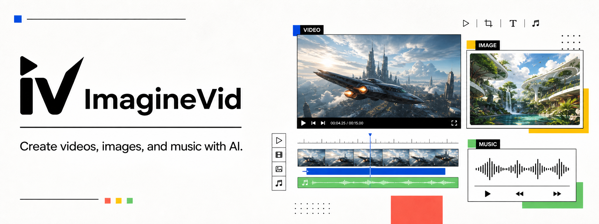

<!--
[INPUT]: Uses the ImagineVid product routes and profile/assets/imaginevid-product-banner.png.
[OUTPUT]: Renders the public imagineVid GitHub organization profile.
[POS]: Product-first organization overview; open-source repositories appear only as supporting resources.
[PROTOCOL]: 变更时更新此头部，然后检查 AGENTS.md
-->

  

  <strong>One creative workspace for AI video, image, and music generation.</strong> 
  Turn a prompt, image, or visual reference into production-ready creative without stitching together separate tools.

  <a href="https://imaginevid.io/"><strong>Open ImagineVid</strong></a>
  &nbsp;&nbsp;|&nbsp;&nbsp;
  <a href="https://imaginevid.io/pricing">View pricing</a>

## Create With ImagineVid

<table>
  <thead>
    <tr>
      <th width="22%" align="left">Product</th>
      <th align="left">What you can create</th>
    </tr>
  </thead>
  <tbody>
    <tr>
      <td><strong>AI Video</strong></td>
      <td>
        Generate clips from text, animate still images, or direct motion with visual references. Move from a written scene or approved visual to a finished clip with control over framing, action, pacing, and sound.  
        <strong>Explore:</strong> <a href="https://imaginevid.io/text-to-video">Text to video</a> · <a href="https://imaginevid.io/image-to-video">Image to video</a> · <a href="https://imaginevid.io/reference-video">Reference to video</a>
      </td>
    </tr>
    <tr>
      <td><strong>AI Image</strong></td>
      <td>
        Create and transform images for concepts, campaigns, stories, and production assets. Develop new visuals from a prompt or refine existing media inside the same creative workspace.  
        <strong>Explore:</strong> <a href="https://imaginevid.io/ai-image-generator">Create AI images</a>
      </td>
    </tr>
    <tr>
      <td><strong>AI Music</strong></td>
      <td>
        Generate original music for videos, social content, and creative projects. Build a soundtrack around the mood, energy, and intended use of your work without leaving ImagineVid.  
        <strong>Explore:</strong> <a href="https://imaginevid.io/ai-music-generator">Create AI music</a>
      </td>
    </tr>
  </tbody>
</table>

## From Idea to Publishable Creative

ImagineVid keeps the creative process connected from the first direction to the final asset.

<table>
  <tbody>
    <tr>
      <td width="22%"><strong>Start</strong></td>
      <td>Begin with a written prompt, an existing image, or visual references for a character, product, or scene.</td>
    </tr>
    <tr>
      <td><strong>Create</strong></td>
      <td>Generate video, images, or music with the workflow and model that fit the job.</td>
    </tr>
    <tr>
      <td><strong>Refine</strong></td>
      <td>Shape motion, framing, pacing, sound, style, continuity, and format without rebuilding the project elsewhere.</td>
    </tr>
    <tr>
      <td><strong>Publish</strong></td>
      <td>Develop social videos, product visuals, campaign concepts, stories, presentations, and other production-ready creative.</td>
    </tr>
  </tbody>
</table>

  <strong>Ready to turn an idea into something you can share?</strong>  
  <a href="https://imaginevid.io/"><strong>Start creating with ImagineVid</strong></a>
  &nbsp;&nbsp;|&nbsp;&nbsp;
  <a href="https://imaginevid.io/pricing">Explore plans</a>

---

### Open Resources

Looking for reusable prompt structures and model-specific production techniques? Explore the source-backed research and public guides maintained by the ImagineVid team in this organization.
